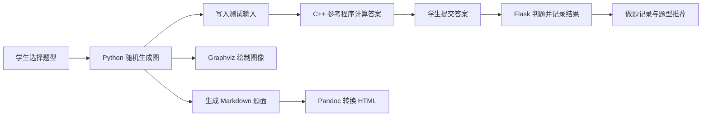

# 2022 Algorithm Learning Platform

2022 年课程作业与毕业设计项目：一个面向图算法学习的动态练习平台原型。

项目以 Flask 提供后端 API。学生选择算法类型后，系统会随机生成一张图和对应题目，调用 C++ 参考程序计算标准答案，并用 Graphviz、Pandoc 生成图像与 HTML 题面。系统同时记录答题状态和正确率，并提供基础的课程、作业与题型推荐功能。

> 本仓库保留了毕业设计的实现思路和演进痕迹，定位是教学与研究原型，不是具备代码沙箱、多语言提交和资源隔离能力的生产级 OJ。

## 核心流程



每道题使用 SHA-256 风格的编号关联以下运行时文件：

- `data/input/<problem_id>.in`：参考程序输入
- `data/answer/<problem_id>.ans`：标准答案
- `data/problem/<problem_id>.md`：Markdown 题面
- `data/html/<problem_id>.html`：HTML 题面
- `data/dot/<problem_id>.dot`：Graphviz 图描述
- `images/<problem_id>.png`：题目配图
- `data/record/<problem_id>.ans`：用户最近一次答案

这些文件属于运行时产物，不纳入 Git。

## 支持的算法练习

| API 类型 | 题目 | 生成方式 | 参考求解程序 |
| --- | --- | --- | --- |
| `shortestpath` | 单源最短路 | 随机有权有向图 | Dijkstra |
| `tsp` | 旅行商问题 | 随机完全有向图 | 深度优先搜索与剪枝 |
| `spantree` | 支撑树计数 | 随机无权图，并指定必含/不含边 | 矩阵树方法 |
| `roottree` | 根树计数 | 随机有向图，并指定根和边约束 | 有向矩阵树方法 |

生成器位于 `algorithm/<type>/generator.py`，参考程序位于对应目录的 `program/` 中。启动 `manage.py` 时会先用 `g++` 编译四个参考程序。

## 已实现功能

- 基于 Flask-Login 的会话登录与登录状态查询
- 动态生成题目、读取未完成题目和提交答案
- 题目图片访问、做题记录和完成状态统计
- 根据各题型的练习量与未完成情况给出基础推荐
- 教师创建课程、查看学生和布置算法作业
- 学生查看作业及完成情况
- SQLite 数据存储与 Alembic 数据库迁移
- 脱敏样例数据库和核心 API 回归测试

## 当前边界

- 注册接口目前按原业务设计保持关闭，样例账号可用于本地体验。
- 判题方式是将答案与参考答案进行文本比对，不接收或执行学生代码。
- C++ 参考程序直接在宿主机运行，没有容器或沙箱隔离。
- 课程模块提供基础数据与接口，完整的选课流程和前端交互仍待补充。
- `templates/` 中的页面是早期模板；当前主要能力通过 JSON API 提供。
- 题目生成依赖本机的 `g++`、Graphviz 和 Pandoc。

## 技术组成

- Python 3.9
- Flask、Flask-Login、Flask-SQLAlchemy、Flask-Migrate
- SQLite、Alembic
- C++ 参考算法程序
- Graphviz：将随机图渲染为 PNG
- Pandoc：将 Markdown 题面转换为 HTML

## 本地运行

### 1. 安装系统工具

确认以下命令可用：

```bash
g++ --version
dot -V
pandoc --version
```

macOS 可使用 Homebrew 安装缺失工具：

```bash
brew install graphviz pandoc
```

### 2. 创建 Python 环境

```bash
python3 -m venv .venv
source .venv/bin/activate
pip install -r requirements.txt
```

### 3. 配置应用

```bash
export SECRET_KEY='请替换为随机字符串'
```

可选环境变量：

- `SECRET_KEY`：Flask 会话签名密钥；部署时必须设置。
- `DATABASE_URL`：SQLAlchemy 数据库地址；默认值为 `sqlite:///site.db`。

### 4. 准备数据库

创建空白数据库：

```bash
FLASK_APP=app flask db upgrade
```

也可以复制仓库内的脱敏样例库：

```bash
cp sample/site.sample.db site.db
```

样例账号如下：

| 角色 | 用户名 | 密码 |
| --- | --- | --- |
| 教师 | `sample_teacher` | `sample-pass` |
| 学生 | `sample_student` | `sample-pass` |

### 5. 启动服务

```bash
python manage.py
```

默认监听 `http://127.0.0.1:5000`。启动过程会编译四个 C++ 参考程序；首次请求新题目时还会调用 `dot` 和 `pandoc`。

## 测试

```bash
pip install -r requirements-dev.txt
pytest -q
```

测试覆盖登录保护、旧密码升级、课程创建、作业创建、题型推荐和题目访问校验。C++ 程序可以额外执行语法检查：

```bash
for source in algorithm/*/program/*.cpp; do
  g++ -std=c++11 -fsyntax-only "$source"
done
```

## 项目结构

```text
.
├── algorithm/          # 四类题目的随机生成器和 C++ 参考程序
├── data/               # 题面模板及运行时输入、答案、记录
├── dots/               # Graphviz DOT 内容生成
├── images/             # 固定示例图及运行时题目图片
├── migrations/         # Alembic 数据库迁移
├── sample/             # 脱敏样例数据库与说明
├── templates/          # 早期 HTML 页面模板
├── tests/              # Flask API 回归测试
├── views/              # 用户、题目、算法、课程和工具蓝图
├── app.py              # Flask 应用工厂、扩展初始化与蓝图注册
├── manage.py           # 编译参考程序并启动开发服务器
└── models.py           # 用户、题目、课程和作业模型
```

## 接口文档

接口路径、参数和常见状态码见 [API.md](API.md)。各算法目录中的 `Readme.md` 记录了对应题目的输入与求解背景。

## 数据与隐私

- `site.db`、生成题目、答案、图片和下载文件均已加入 `.gitignore`。
- `sample/site.sample.db` 只包含虚构账号和 `example.invalid` 邮箱。
- 旧版原始数据库可能包含真实邮箱和历史明文密码，不应提交、分享或用作公开样例。
